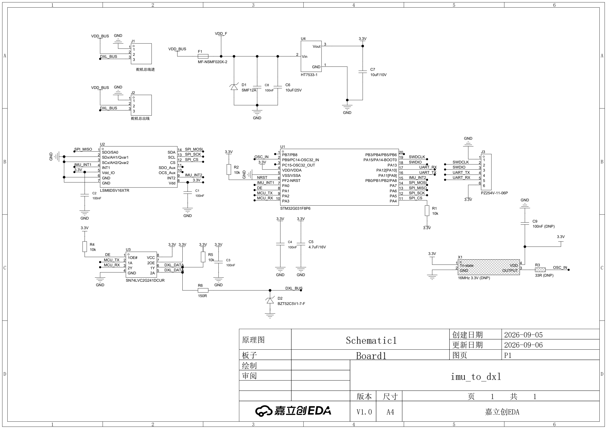

# imu_to_dxl 原理图 · 求评审

> ⚠️ **这是第三方复刻件，不是官方设计。**
> 官方从未公开这块板的原理图、Gerber 或外形（全网零命中，见
> [硬件方案逆向](../../docs/硬件方案逆向.md)）。本目录是根据 MJCF 模型、官方运行时源码
> 和已开源的 HAT 工程反推 + 自行选型的结果，**未经打样、未经实物验证**。
> 发现问题请开 [issue](https://github.com/fanhao375/microduck-replica/issues)。



| 文件 | 说明 |
|---|---|
| [`imu_to_dxl-原理图.pdf`](imu_to_dxl-原理图.pdf) | 矢量 PDF，放大看细节 |
| [`imu_to_dxl-接线表.md`](imu_to_dxl-接线表.md) | 逐网络列出每个引脚，可以直接对着核 |
| [`imu_to_dxl.eprj2`](imu_to_dxl.eprj2) | 嘉立创 EDA 专业版工程，可直接打开改 |
| [`../../BOM.md`](../../BOM.md) | 完整 BOM，含立创编号与每颗器件的选型理由 |

---

## 这块板干什么

官方 Microduck 的 15 个舵机挂在一条 Dynamixel 半双工总线上。这块小板
**作为第 16 个设备挂在同一条总线上**，对外表现成一个 Dynamixel 从机（ID 200），
主控用读寄存器的方式向它要姿态数据。

板上的 IMU 用的是 **LSM6DSV16X**，它片内有 **SFLP 硬件融合块**，
直接输出游戏旋转四元数 —— 姿态解算不占主控算力，也不占总线带宽。

```
主控（树莓派/泰山派）
      │  1 Mbps 半双工单线
      ├── 舵机 ×15
      └── imu_to_dxl（本板，ID 200）
             ├── LSM6DSV16X   SPI 四线 + 两路中断
             ├── STM32G031F8P6 收包 / 组包 / 读 IMU
             └── SN74LVC2G241 半双工收发缓冲
```

## 核心选型与理由

| 位号 | 器件 | 为什么选它 |
|---|---|---|
| **U1** | STM32G031F8P6 | ① USART 有**硬件 DE**（RS485 Driver Enable）—— 1 Mbps 下一个比特只有 1 µs，软件翻方向脚的抖动就在这个量级。对照：**STM32F401 手册全文没有 "Driver Enable"**，只能软件切<br>② 与 IMU 同厂，ST 的 `lsm6dsv16x-pid` 驱动和 SFLP 例程现成 |
| **U2** | LSM6DSV16XTR | 片内 SFLP 融合，直接出四元数 |
| **U3** | SN74LVC2G241DCUR | 双缓冲做单线半双工。通道 1 左进右出、通道 2 右进左出，正好对着走线。3.3 V 供电时**输入耐 5.5 V**，扛得住舵机 5 V 的信号 |
| **U4** | HT7533-1 | **耐压 30 V** —— 前两道保护都失效时它自己还活着 |
| **F1** | PPTC MF-NSMF020X-2 | **24 V / 200 mA 保持**。本板故障时先断自己，不拖垮整条舵机总线 |
| **D1** | TVS SMF12A | 截止 12 V > 满电 8.4 V，钳位 19.9 V < C6 的 25 V 耐压 |
| **C6** | 10 µF / **25 V** | 挂在 8.4 V 母线上。MLCC 有直流偏压衰减，6.3 V/10 V 的余量不够 |
| **C5** | 4.7 µF | 与 C4 的 100 nF 组成 ST 要求的组合 —— **DS12992 Rev 3, Figure 13** 对 `VDD/VDDA` 明确标注 `1 × 100 nF + 1 × 4.7 μF` |

## 几个可能有争议的决定

### 1. `2OE` 接常高，发送时会听到自己的回显

`U3.1 (1OE#)` 接 DE 控制发送缓冲，`U3.7 (2OE)` **直接接 3.3 V，接收缓冲常开**。

- 代价：发送时 MCU 会在 RX 上收到自己发的字节，固件按发送长度丢弃
- 好处：PA3 永远有人驱动，**不会悬空**

备选是 `2OE` 也接 DE（发送时关掉接收），但那样发送期间 RX 浮空，
重新使能时可能产生假起始位。我选了前者，**欢迎反驳**。

### 2. 没有晶振，只留了焊盘

TSSOP-20 封装**没有引出 `OSC_OUT`**（DS12992 Rev 3, Table 12：2 脚 `PC14` 的附加功能有
`OSC_IN`，3 脚 `PC15` 只有 `OSC32_OUT`），所以**无源晶振根本接不了**。

HSI16 精度（Table 41）：出厂 −0.75%/+0.5%，0–85 °C 温漂 ±1% → 最坏约 **−1.85%/+1.55%**。
1 Mbps 异步 UART 典型容差 ±3%，够用但余量不多。

板上留了 **X1（16 MHz 有源晶振，HSE 旁路）+ C9 + R3** 三个焊盘，**默认不贴（DNP）**。
另外固件可以用定时器输入捕获测主机来的比特周期，反调 `HSITRIM`（步进 0.2–0.4%/档），
误差能压到 0.3% 以内，不花钱。

### 3. J1 / J2 保留两个，靠铜皮解决过流

J1 和 J2 三根线一一并联。**本板若在链条中间，下游全部舵机电流都流过本板的连接器和铜箔。**

飞特 HD-1910-C001 官方参数：额定 **500 mA** / 堵转 **1.8 A**。

但这个约束**不是本板独有的** —— 舵机之间本来就是菊花链，它们自己的连接器承受同样的电流。
HAT 有 **4 个舵机接口**，15 个舵机分在 4 条支路上，每条最多 4 个，一条支路额定约 **2 A**，
在 3 A 以内。官方设计能接受，本板用同样的座子不会更差。

**所以保留两个座子**：想挂末端就不装 J2，想串中间就装上，灵活性几乎零成本。
PCB 上把 `VDD_BUS` 与 `GND` 从 J1 到 J2 走**大铜皮**（≥ 2 mm 或直接铺铜）即可。

> 曾有评审意见建议「只留一个 3P 座子」。那在本板确定是叶子节点时成立，
> 但**如果它是链条第一个节点**（HAT 出来先进本板、再出去给舵机），就必须两个。
> 官方拓扑无从确认，保留两个更稳。

### 4. 协议靠软件自动识别，没做跳线/拨码

飞特与 Dynamixel 的物理层完全相同（半双工单线 / 1 Mbps / 3 线 / GND-VCC-DATA），
差别只在包格式：

| | 包头 | 后续 | 校验 |
|---|---|---|---|
| Dynamixel V2 | `FF FF` | **`FD 00`** | CRC-16 |
| 飞特 SCS | `FF FF` | `ID` + `LENGTH` | `~(ID+LEN+INST+参数)` |

飞特官方协议文档写明 **Length = 参数个数 N + 2**，所以最小为 2、**永远不会是 0**；
ID 范围 0–253。→ `FF FF FD 00` 只可能是 V2，**判别无歧义**。

固件收前 3 包投票锁定协议，之后按锁定的收发；连续 100 包解析失败则解锁重判。
比拨码开关可靠（会走路的机器人里，拨码触点是振动失效点）。

### 5. J3 用 6P，把串口 printf 也引出来

`1=GND 2=SWDCLK 3=SWDIO 4=UART_TX 5=UART_RX 6=+3V3`，前 4 脚顺序不变，
**原来的 4 针 SWD 排线插 1–4 仍可用**。

UART 来自 U1 脚 16/17（`PA11[PA9]` / `PA12[PA10]`），经 `SYSCFG_CFGR1` 重映射成
`USART1_TX/RX`。

**不上 USB**：G031 没有 USB 外设（手册 Development support 只写 "serial wire debug (SWD)"），
加 USB 要多一颗 CH340/CP2102，45 × 22 mm 板上不划算。
调试走 SWD + RTT（`probe-rs` 支持在 CMSIS-DAP 上跑 RTT，不停 CPU）。

> Cortex-M0+ **没有 SWO/ITM**，别指望 SWO printf。

---

## 想请你重点看这几处

1. **`2OE` 常开这个取舍**（上面第 1 条）—— 回显 vs RX 悬空，哪个更糟
2. **J1/J2 过流与铜皮宽度**（第 3 条）—— 2 mm 够不够
3. **HSI16 跑 1 Mbps 的余量**（第 2 条）—— 有实测经验的说一声
4. **三道过压防线够不够** —— 8.4 V 母线 + 舵机反电动势
5. **连接器**：飞特线材是 `AMP-3` / 5264 端子，官方 HAT 用 JST EH，
   两者**同为 2.5 mm 间距但不同系列**，能否对插还没拿实物比过

## 已确认 / 未验证

**已确认（一手资料）**

- 飞特接口 `1=GND / 2=Vcc / 3=Signal/TTL`，连接器 `AMP-3`
  —— 飞特《HL-2915-C002 串型规格书》A/0 第 4 页 6-7 项
- HD-1910-C001 走 **TTL 三针总线**，5–8.4 V，堵转 10 kg·cm，额定电流 500 mA
  —— 飞特官方产品页
- 包格式、`Length = N+2`、校验算法、同步读 `0x82` —— 飞特官方《舵机SCS通信协议》
- STM32G031 无 HSE 引脚、HSI16 精度、`100 nF + 4.7 µF` 去耦要求 —— ST DS12992 Rev 3
- 原理图连通性 —— 已用脚本逐网络核对，无悬空脚、无短路、无重名网络

**未验证**

- **整块板没打样过**，没有实物
- 板框 45 × 22 mm 与 M2 孔距 34 mm 是从打印件 `banana_pcb_locker` 反推的，非官方尺寸
- MCU 型号是本仓库的选型建议，**不是逆向所得** —— 官方那块板用什么 MCU 无从还原

---

## 评审记录

### 2026-09-06 · 社区反馈（三条，两条已改）

**① DE 脚要上拉 —— 已改，这是漏项**

`U3.1 (1OE#)` 是低电平使能发送。上电与复位期间 MCU 的 **PA1 是高阻**，此脚浮空；
**若浮成低电平，发送缓冲就打开，本板会往总线上灌数据、与 15 个舵机全部撞车。**

已加 **R4 10 kΩ，DE → 3.3 V**。

此前在 `SPI_CS` 上加 R1 上拉正是同一个道理，**但没有推广到 DE**，属实是疏漏。

**② 两个 `DXL_DATA` 要连一起并上拉 —— 已改**

电气上原本就是同一个网络（`U3.5 2A` / `U3.6 1Y` / `J1.3` / `J2.3`），
但图上画成了两根各自带标签的短线，**看起来像没连**，是画法不够直观。已改为显式连接节点。

上拉这条也对：总线空闲无人驱动时，`2A` 这个 CMOS 输入浮空会有穿透电流，
UART 也可能把噪声当起始位 —— 本板应当自己定义空闲电平，不该依赖主机。
已加 **R5 10 kΩ，DXL_DATA → 3.3 V**。

**③ 只留一个 3P 连接器 —— 未采纳，理由见上面第 3 条**

该建议在本板确定为叶子节点时成立；但若本板是链条第一个节点则必须两个座子，
而官方拓扑无从确认。保留两个，靠铜皮宽度解决过流。

改完复核：`DE` 由 2 脚变 3 脚，`DXL_DATA` 由 4 脚变 5 脚，
全图无悬空脚、无短路、无重名网络。

### 2026-09-06 · 对照官方 HAT 复审（补两处保护）

把 [`pollen-robotics/elec_RPI_Robot_HAT`](https://github.com/pollen-robotics/elec_RPI_Robot_HAT)
的 `dynamixel.kicad_sch` 逐器件读了一遍，和本板对比。

**HAT 的 TTL 半双工电路**

```
                        ┌── R31 10k ── +3V3
   IO_15 (RX) ◄── U6 ───┘                    ┌── R32 10k ── +3V3
              (1G125, OE# 低有效)             │
                        ▲                     ▼
   IO_14 (TX) ──┬── U7 ──────────────────────► ● ── R33 150R ──┬── TH1 100R ── J13.3 / J14.3
                │  (1G126, OE 高有效)                       D4 5V1
                └── R27 10k ── Q1 (PNP) ── Dynamixel_dir        ⏚
```

**逐项对比**

| | 官方 HAT | 本板 | |
|---|---|---|---|
| 收发缓冲 | 1G125 + 1G126 两颗 | SN74LVC2G241 一颗 | 同逻辑 |
| 方向控制 | 从 TX 自动派生（Q1 + RC） | **USART2 硬件 DE** | 本板更好，见下 |
| 总线上拉 | R32 10 kΩ | R5 10 kΩ | 一致 |
| **数据线串阻** | R33 150 Ω + TH1 100 Ω | ❌ 无 → **已补 R6 150 Ω** | |
| **数据线钳位** | D4 5V1 | ❌ 无 → **已补 D2 5V1（同料号 `C151348`）** | |
| 电源保护 | 无（`+BATT` 直通连接器） | F1 PPTC + D1 TVS | 本板更好 |

**方向控制为什么本板更好**：HAT 从 TX 派生方向，靠 RC 时序回到接收态，
**释放早了会截断最后一个停止位**——这是 TX 派生方案的通病。
本板用 `USART2` 的硬件 DE，`DEAT`/`DEDT` 可按 1/16 比特精调，不存在这个问题。

**补完之后的数据线拓扑**（与 HAT 同构）：

```
U3.6 (1Y) ──┬─ DXL_DATA ─┬── R5 10k → 3.3V
U3.5 (2A) ──┘            │
                         └── R6 150Ω ──┬── DXL_BUS ── J1.3 / J2.3
                                       │
                                    D2 5V1
                                       ⏚
```

上拉留在**缓冲侧**（R5 在 R6 之前），与 HAT 的 R32 位置一致 ——
这样即使不插总线，`2A` 这个 CMOS 输入也有确定电平。

本板只串 150 Ω（HAT 是 250 Ω），因为 HAT 侧已经有 250 Ω，
总线上串太多会拖慢边沿。

复核：`DXL_DATA`（缓冲侧）4 脚、`DXL_BUS`（连接器侧）4 脚，
全图无悬空脚、无短路、无重名网络。

**顺带纠正本文档此前一处错误**：HAT 的 `TH1 100R 热敏`串在**数据线**上，
不是电源线上。`+BATT` 到 J13/J14 的第 2 脚是**粗线直通、无限流**。

### 2026-09-06 · 阻容封装统一改 0603

所有 0402 阻容改为 **0603**，D2 从 SOD-323 改为 **SOD-123**。

理由不是「0402 手焊不了」—— 板上有 **LGA-14 的 LSM6DSV16X**（底部焊盘 3 × 2.5 mm），
本来就必须上热风或回流，有那套工具 0402 也不难。

**真正的理由是调试期返修**：串阻要从 150 Ω 试到 33 Ω、某个上拉要摘掉、
去耦要补一颗 —— 这些在 0603 上拿烙铁几秒就能做，0402 得重新架热风。
一块没打样验证过的板子，第一版必然要改几次。

代价很小：11 个器件多占约 16 mm²，不到 45 × 22 mm 板面积的 2%。
而且 0603 这几个值**全在立创基础库**（10 kΩ `C25804` · 150 Ω `C22808` ·
33 Ω `C23140` · 100 nF `C14663`），比原来 0402 的扩展库还省上料费。

> C6（10 µF/25 V）保持 0805；C5（4.7 µF）、C7（10 µF）本来就是 0603。

换封装时同坐标同角度重放，实测**引脚坐标不变、连线一根没断**。
一个坑：`SOD-123` 的符号引脚顺序与 `SOD-323` 相反，换完 **D2 极性翻了**
（阴极跑到接地侧，正常工作会把总线钳到 0.7 V），已按引脚名核对并改正。
`create()` 的 `rotation` 参数在这个 API 里符号相反 —— 传 90 存进去是 270。
